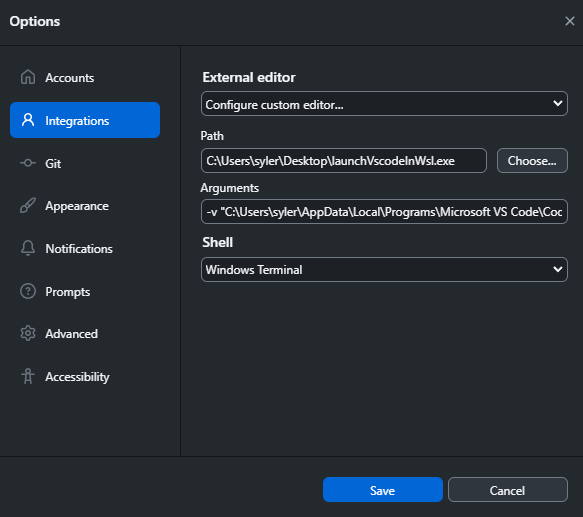

# launch-vscode-in-wsl (for github desktop)

A horrible solution (100mb executable), but it works for me&#8482;

## Usage

1. Run `bun compile`
2. Copy `launchVscodeInWsl.exe` somewhere in windows
3. Update github desktop integration



```sh
-v "C:\Users\syler\AppData\Local\Programs\Microsoft VS Code\Code.exe" -p %TARGET_PATH%
```